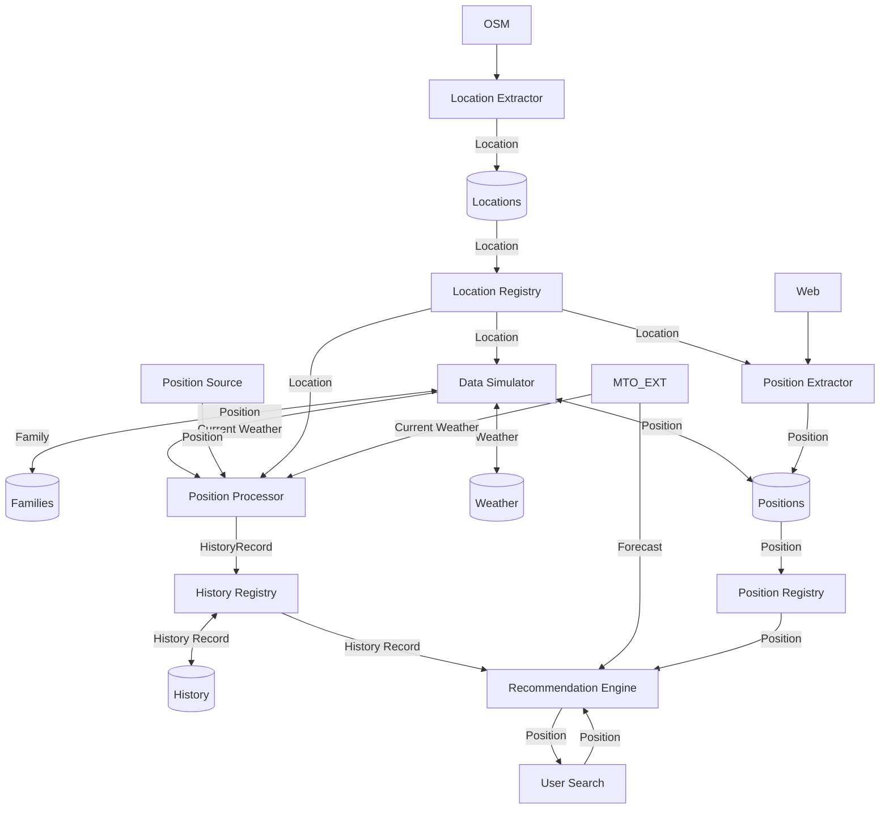

# Architecture

## Workflow
The general workflow of the application is the following:

## Concepts

### Location
A **Location** represents a real-world place of interest, such as a venue, institution, or business. Locations are central to the application's data model and are used for event assignment and recommendations. Each location has:
- A unique identifier (`id`)
- A name (`name`)
- A type (`location_type`), such as church, school, restaurant, work place, etc. (see `LocationType` enum)
- A geographic position (`position`), with latitude and longitude
- Optional opening hours and additional metadata (e.g., address, category, tags)

Locations are extracted from OpenStreetMap (OSM) and stored in the unified GeoJSON file. The `category` property in the GeoJSON reflects the original kind of extractor (e.g., church, entertainment, work, hospitality, educational).

### Position
A **Position** represents a geographic coordinate and its context in time and application usage. It is a central concept for both static locations and dynamic person movement. A position can be:
- The fixed location of a place (venue, institution, etc.)
- The dynamic position of a person at a specific time (i.e., a movement or activity)

A position includes:
- `latitude`: The north-south coordinate
- `longitude`: The east-west coordinate

When used for tracking, a position is enriched with temporal and contextual attributes:
- `person_id`: The unique identifier of the person (for movement)
- `date`, `horaire`: Date and time (for user-facing positions)
