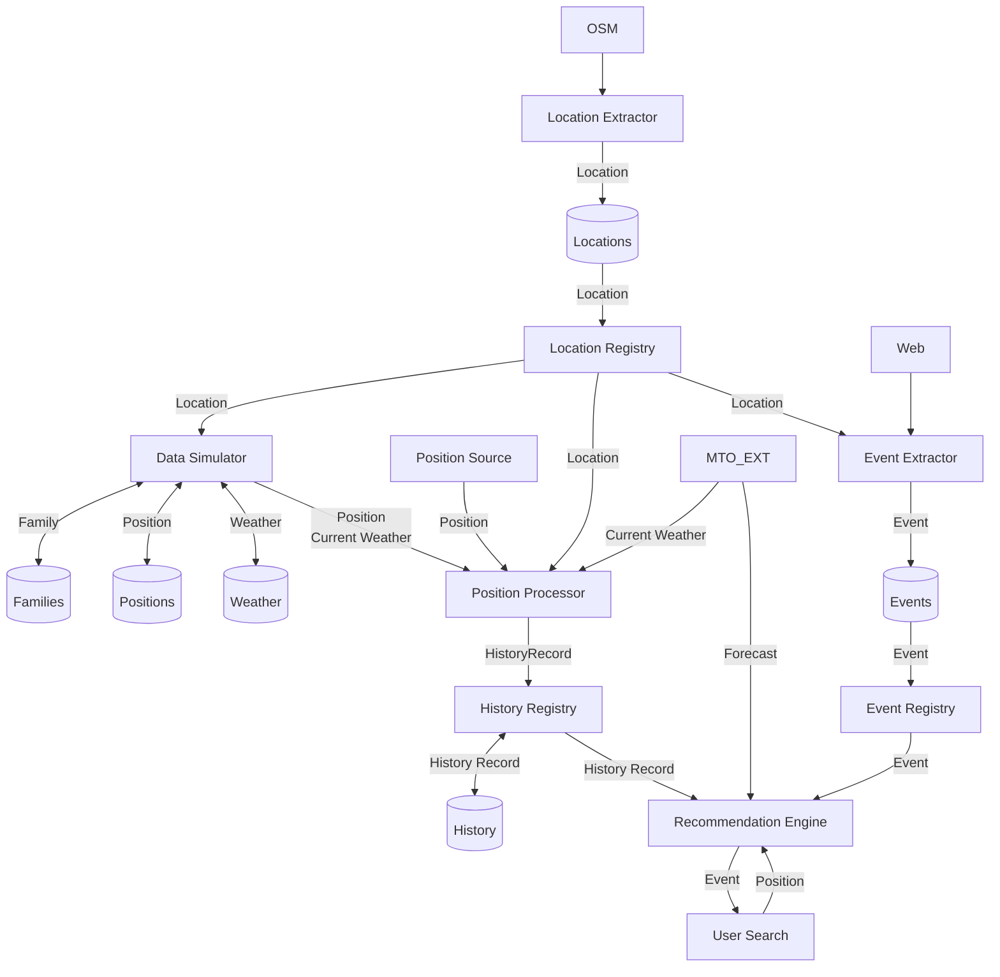
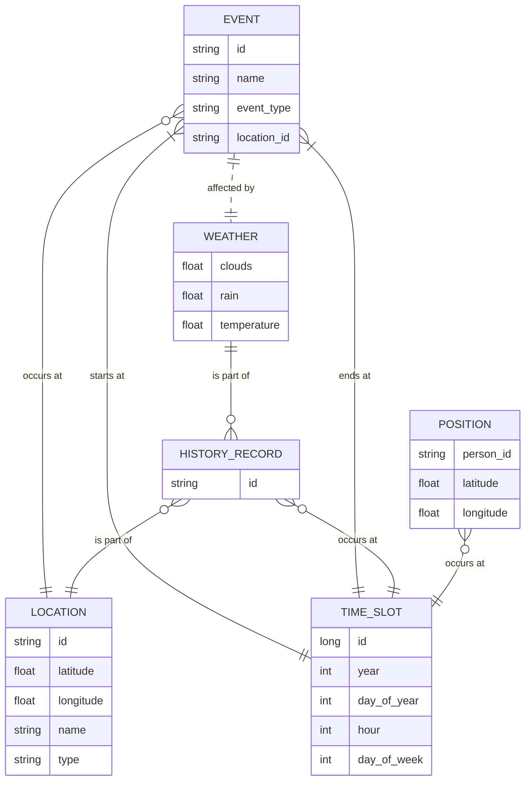

# Architecture

## Workflow
The general workflow of the application is as follows:

## Concepts

The following diagrams summarizes the concepts defined in this section:

### Time slot
For the volumetry of the system to be supportable, the time is sliced in slots characterized by:
- A unique **identifier** composed of the three following attributes
- The **year**
- The **day** in year
- The **hour** in day
- The day in **week**

### Position
A **Position** represents a geographic coordinate and its context in time and application usage. Since the system operates at the scale of a city, the precise location is not critical—positions are used mainly to represent the presence or movement of people within the city. A position includes:
- `latitude`: The north-south coordinate
- `longitude`: The east-west coordinate
- `person_id`: The unique identifier of the person (for movement)
- `slot`: The time slot

### Location
A **Location** refers to a specific geographic point or area within the city, often associated with meaningful places such as buildings, parks, intersections, or venues. Locations provide semantic context to raw geographic coordinates, enabling the system to relate positions and events to recognizable places. Each location typically includes:
- `latitude` and `longitude`: The central coordinates of the location
- `name`: A human-readable identifier (e.g., "Central Park", "Library")
- `type`: The category of the location (e.g., park, school, restaurant)
- Optional metadata, such as address, description, or tags

Locations are extracted from external sources (e.g., OpenStreetMap) and maintained in a registry to support event association, user queries, and recommendation logic.

### Event
An **Event** represents an occurrence or activity associated with a specific time. Events are central to the application's purpose of discovering and recommending relevant happenings to users. Each event has:
- A unique identifier (`id`)
- A descriptive name (`name`)
- A location where the event occurs (`location`)
- A start and end time slots (`start_time`, `end_time`)
- A type or category (`event_type`), such as religious service, class, meal, meeting, etc.
- Optional metadata, such as description, tags, or organizer information

### Weather
A **Weather** entity captures atmospheric conditions relevant to a specific time in the city. The system distinguishes between:
- **Current Weather**: Real-time meteorological data for the city.
- **Weather Forecast**: Predicted weather conditions for future time intervals.

The weather parameters used are:
- `clouds`: Cloud cover percentage or description
- `rain`: Precipitation amount or probability
- `temperature`: Air temperature in degrees Celsius

Weather data is sourced from external providers and linked to events and user activities to enhance recommendations and user experience.

### History Record
A **History Record** aggregates information about a person's presence at a specific location and time, along with the corresponding weather conditions. It combines:
- A **Location**
- A **time slot**
- The **Weather** at that time and place

This record enables the system to analyze user movement patterns and contextual factors, supporting personalized recommendations and insights.